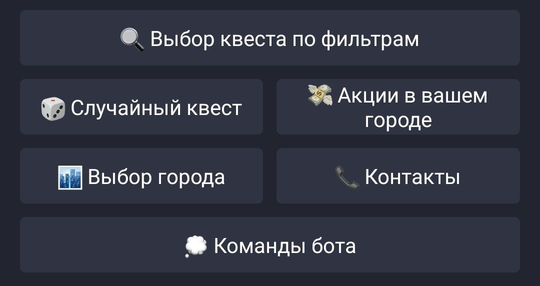
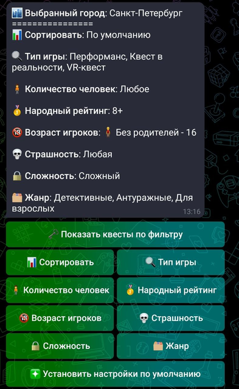

# TBOT-QuestWorld

### Гит репозиторий телеграмм бота, основанного на сайте сервиса "Мир квестов"

#### Developed by ___M_I_L_K_A___

###### ___Данный проект не является заказом компании "Мир квестов". Это желание сделать интересный и полезный проект___


### Основные функции:

* Выбор параметров, по которым будет происходить фильтрация квестов.
* Выбор квеста по выбранным параметрам.
* Выбор случайного квеста из базы выбранного города.
* Демонстрация акций в выбранном городе.
* Выбор города из базы сервиса "Мир квестов".



## Основные данные и параметры:

Для полноценной работы телеграм бота пользователю необходимо имееть следющие параметры:

* `city`, `pretty_city_name`, `main_city_link`: параметры, связанные с выбранным городом пользователя. По умолчанию
  установлены `city="москва"`, `pretty_city_name="Москва`, `main_city_link="https://mir-kvestov.ru/"`
  Пользователь отправляет первый параметр, благодаря чему происходит поиск соответсвующих оставшихся парааметров.
  `pretty_city_name` используется для более комфортной демонстрации выбранного города.

* `quest_dict`: словарь с хранящимися квестами, которые заполняются и удаляются по мере необходимости (для
  предотвращения переполнения памяти).
* `default_params_quest_filter`: пользовательские параметры, которые используются для демонстрации квестов по данным из
  этого словаря.
* `class FilterParameter(object)`: данный класс используется для демонстрации и обработки фильтров. Каждый фильтр
  обладает следующими свойствами:

1) `user_text`: данный текст выводится на `inline-keyboard`.
2) `param_text`: текст, используемый для обработки `callback_data`.
3) `subcategory_param`: словарь с подкатегориями.
4) `link_param`: параметр, к которому впоследствии добавляются данные из `default_params_quest_filter` и образуется
   ссылка, по которой происходит парсинг квестов.
5) `default_param`: параметр по умолчанию, который используется в `default_params_quest_filter`.
6) `parameter_type`: тип фильтра. Используется 2 следующих типа: `one_page` и `more_pages`. Первый тип является
   характеристикой одностраничных типов фильтра, а второй многостраничных. Для получения данных с многостраничных
   фильтров используется парсинг с заранее написанной функцией под этот фильтр.
7) `help_link_param`: в случае длинного `callback_value` данный параметр используется для соответствия параметра,
   полученного путем парсинга и более емкого значения.

## Принцип работы функций:

#### Фильтры квестов

Основные методы, занимающиеся данной функцией, находится в файле [filter.py](handlers/users/filter.py). При вызове
соответствующей команды происходит проверка наличия основных данных пользователей. Далее происходит демонстрация списка
всех возможных фильтров, которые может настроить пользователь. Далее программа учитывает нажатие на `inline-button` и
анализ соответствующих кнопе `callback_data`. Список `callback_value` и функций, которые соответствуют значению:

```
* MENU_FILTER: filter_categories_menu,             # Демонстрация списка возможных запросов для фильтрации
* ONE_PAGE_CATEGORY: list_one_page_subcategory,    # Вывод одностраничной подкатегории
* MORE_PAGES_CATEGORY: list_more_page_subcategory, # Вывод многостраничной подкатегории
* PAGE_SUB: update_more_subcategory_keyboard,      # Обновление клавиатуру в многостраничной подкатегории (изменение страницы)
* UPD_VAL: update_filter_information,              # Изменение значения пользователя в параметре default_params_quest_filter
* SHOW_QUEST: show_filtered_quests,                # Показать список квестов по фильтрам пользователя
* DEFAULT_PARAM: use_default_params                # Установка дефолтных параметров default_params_quest_filter
```



#### Список квестов

Работает аналогично предыдущему пункту. Первым сообщением выводятся фотографии отфильтрованных квестов. Далее следующим
сообщением выводятся `inline_buttons`, количество которых равно значению переменной `QUEST_TELEGRAM_PAGE_COUNT`, при
нажатии на которые открывается меню с основной информацией о квестах.

При нажатии на выбранный квест открывается его основная информация, доступная при первом проходе парсера, далее идет
парсинг информации, находящейся на сайте выбранного квеста. Также доступны `inline_buttons`, при нажатии на которые
открывается дополнительная информация/описание игры. Список `callback_value` и функций, которые соответствуют значению:

```
* OPEN_QUEST: show_quest,                          # Демонстрация основного меню квеста с его характеристикой
* OPEN_ADD_INFO: answer_add_quest_params,          # Демонстрация дополнительных параметров квеста
* BACK_QUEST: back_to_quest_info,                  # Возвращение в меню с основными характеристиками квеста
* PAGE: update_keyboard_page,                      # Переход на следующую/предыдущую страницу со списком квестов
* BACK_LIST: back_quest_list                       # Переход на страницу со списком квестов
```


#### Функция "Случайный квест"

Происходит сохранение списка квестов, находящихся по ссылке `main_city_link` + `"\quests""`. Далее выбирается случайный
квест и демонстрируются его основные параметры. Также присутствует `inline_button`, при нажатии на которую показывается
новый
___случайный квест___.

#### Акции в выбранном городе

Происходит сохранение списка квестов и акций с сайта `main_city_link` + `"\offers""`. Существует 2 типа акций:

1) Обычная акция ___(Имеет страницу с её описанием)___
2) Акция "Квест" ___(Является ссылкой на квест)___
   Вывод всего списка акция происходит так же, как и вывод пункте [список квестов](#список-квестов)

#### Выбор города

Выбор города происходит посредством первоначального парсинга информации с
сайта [`https://mir-kvestov.ru/cities`](https://mir-kvestov.ru/cities)
и сохранением информации словарь с городами, записанными нижним регистром без символа `-`. Далее происходит ввода
пользователем значения. В случае наличия введенного значения в составленном словаре, в данных пользователя выбирается
выбранный город и меняются параметры `city`, `pretty_city_name`, `main_city_link`.

## Работа парсеров:

##### Парсеры работают благодаря фреймворку [beautifulsoup4](https://pypi.org/project/beautifulsoup4/)

### Парсинг списка квестов

Функция находится в этом [файле](utils/parse/ParseCitySite.py). Она находит поле с меткой `main`, после чего сохраняет
все элементы с тегом `li` и рассматриваются различные подзначения, заполняемые в словарь со списком всех сохраненных
квестов.

### Парсинг акций

Функции находится в этом [файле](utils/parse/Offers_Parse.py). Происходит получение всех элементов с тегом `h2`, после
чего определяется то, к какому разделу относится анализируемый элемент: к _действующим акциям_ или к их _описанию_.
Далее идет сохранение и парсинг соответствующего раздела ир занесение его в итоговый словарь.

### Парсинг квеста

Функция находится в этом [файле](utils/parse/ParseQuestSite.py). Изначально происходит анализ верхней панели, для
нахождения которой используется поиск по `class_="params-ul"`. Из него берётся информация о стоимости, времени и уровне
страха. Далее со страницы считываются панели _"Описание"_ и _"Особенности"_. В конце обработанные данные сохраняются и
выводятся пользователю.

## Контакты:

🌐 Телеграм: https://t.me/MILKAsuper

✉️ Почта: svakun@gmail.com

📞 тел: +79215830737


